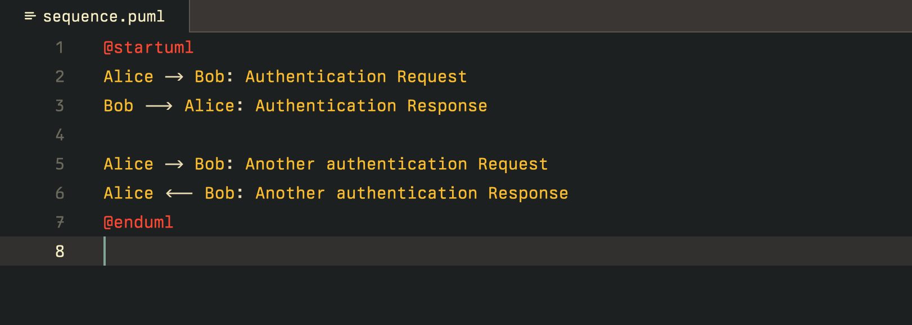
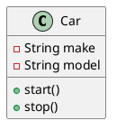

# PlantUML for Zed

An extension that adds PlantUML support for Zed.



Learn more about PlantUML at <https://plantuml.com>

## Installation

1. Open the Zed Extension Gallery by:<br />
  a. pressing `cmd-shift-x` (macOS)<br />
  b. or pressing `ctrl-shift-x` (Linux)<br />
  c. or triggering the `zed: extensions` command from the command pallet<br />
  d. or by selecting `"Zed > Extensions"` from the menu bar
2. Search for `"PlantUML"`.
3. Click `"Install"`.

### From Extension Gallery

1. Open the Zed Extension Gallery by:<br />
   a. pressing `cmd-shift-x` (macOS)<br />
   b. or pressing `ctrl-shift-x` (Linux)<br />
   c. or triggering the `zed: extensions` command from the command pallet<br />
   d. or by selecting `"Zed > Extensions"` from the menu bar
2. Search for `"PlantUML"`.
3. Click `"Install"`.

### Building from Source

1. Clone the repository:

```bash
git clone https://github.com/gabeidx/zed-plantuml.git
cd zed-plantuml
```


Install Rust if you haven't already:
```bash
curl --proto '=https' --tlsv1.2 -sSf https://sh.rustup.rs | sh
```

Build the extension:
```bash
cargo build --release
```

## Usage

1. Create a new file with .puml or .plantuml extension
2. Write your PlantUML diagram code
3. Use the command palette ( cmd-shift-p or ctrl-shift-p ) and search for "Preview PlantUML Diagram"
4. The preview will appear in a panel on the right

### Example PlantUML Code



## Development

To work on this extension:

1. Clone the repository
2. Make your changes
3. Build the extension using cargo build --release
4. Install the development version in Zed:
```bash
zed --install-extension .
```

## Troubleshooting

- Make sure you have an active internet connection (required for diagram rendering)
- If the preview doesn't appear, try reloading Zed
- Check that your PlantUML syntax is correct

## Contributing

Contributions are welcome! Please feel free to submit a Pull Request (But first ask permission from @gabeidx).


## Acknowledgments

- Tree-sitter grammar by Szeliga: [tree-sitter-plantuml](https://github.com/Szeliga/tree-sitter-plantuml)
